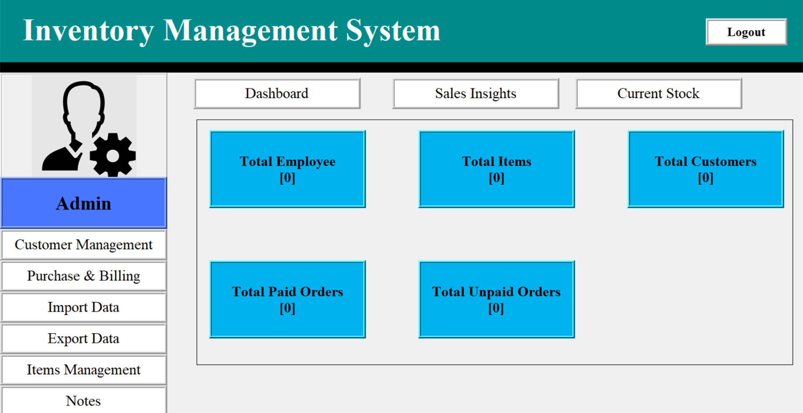
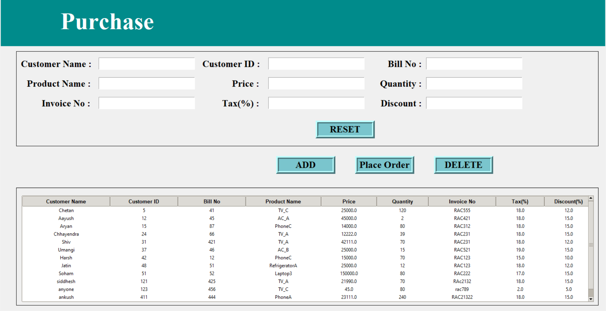
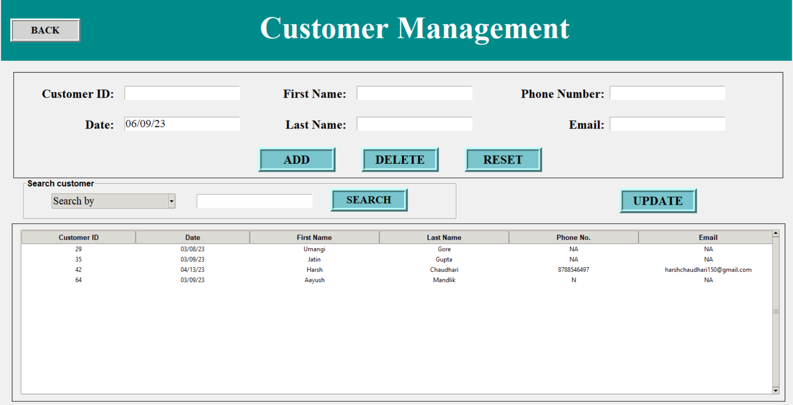
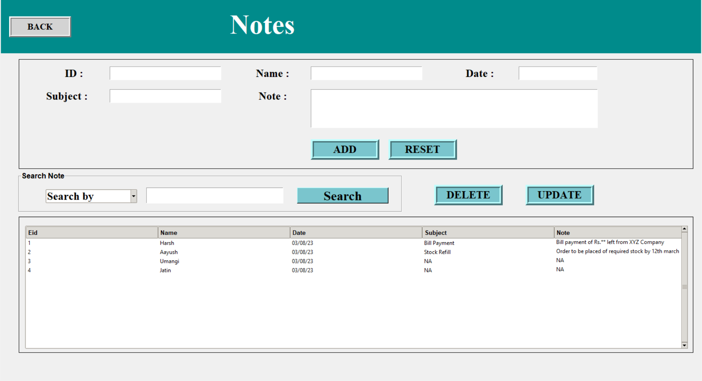
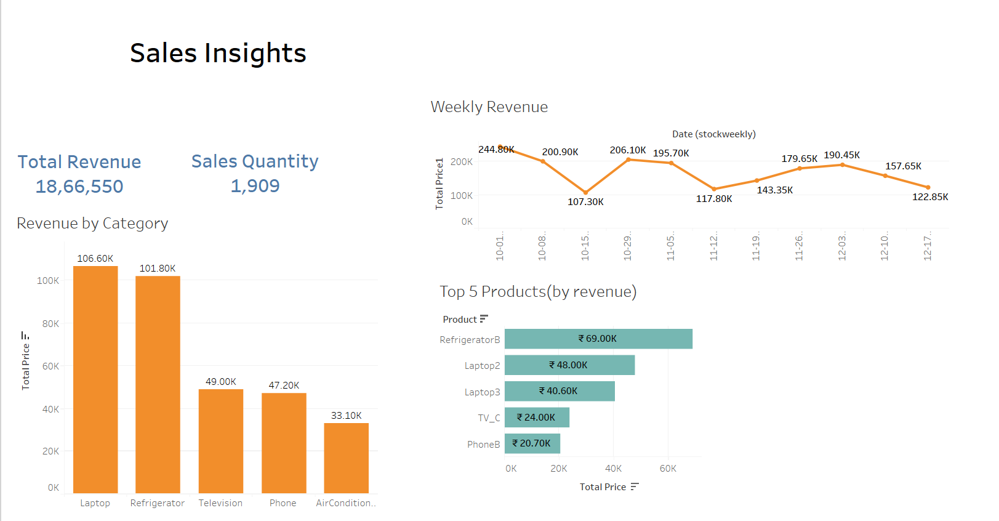
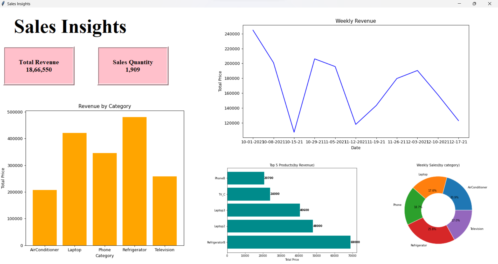
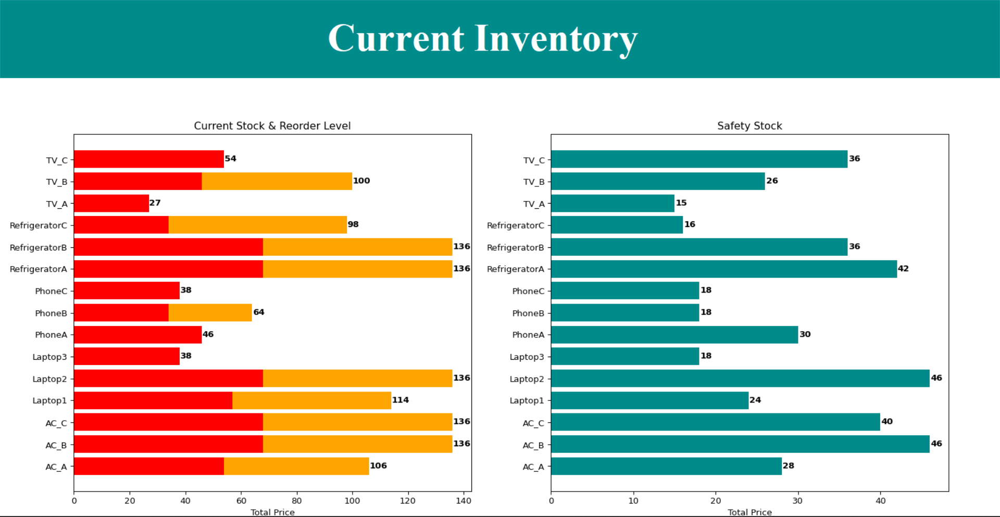

# ims-Python
Inventory Management System Using Python And Tkinter
The inventory management system allows users to monitor and control inventory levels, track product movement, and generate bills for customers. 
The system is designed to enable users to manage their inventory accurately and effectively, ensuring that they have the right products in stock at the right time. 
We have used Tkinter for GUI , SQLite3 for database management , Tableau and Matplotlib for Visualization.
Preview -->

